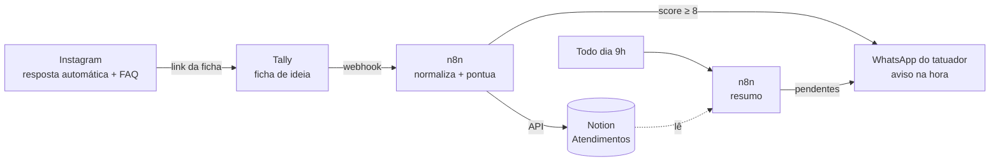

# Pré-atendimento para tatuador

Sistema de primeiro atendimento para um tatuador autônomo da Grande Vitória (ES). O cliente chega pelo Instagram, preenche uma **ficha de ideia** no celular e o tatuador recebe um card pronto no Notion, com nota de prioridade, e um aviso no WhatsApp. Ele continua respondendo pessoalmente, só que já sabendo a ideia, o local, o tamanho, a referência, o prazo e o orçamento.

> Projeto feito para [@russo.tattooer](https://instagram.com/russo.tattooer). Repositório privado: contém a voz e dados de trabalho dele.

## Como funciona



1. **Instagram**: a resposta automática nativa manda o link da ficha. Não usa bot de DM.
2. **Ficha (Tally)**: 17 perguntas base, mais desvios condicionais (cobertura, primeira tattoo, local exposto, cidade fora da Grande Vitória). Foto do local e referências por upload.
3. **n8n**: limpa o payload do Tally, calcula o score (🔥 quente, 🌤 morno, ❄️ frio), cria o card no Notion e separa a região (Grande Vitória ou fora).
4. **WhatsApp (Cloud API oficial)**: ficha quente apita na hora. O resto entra num resumo único às 9h, que também lembra os orçados parados há 5 dias ou mais.
5. **Notion**: board "Responder hoje", pipeline, agenda, galeria de referências e perdidos com motivo.

## Custo

| Peça | Custo mensal |
| --- | --- |
| Instagram (recursos nativos) | R$ 0 |
| Tally (free) | R$ 0 |
| Notion (free) | R$ 0 |
| n8n self-hosted | R$ 0 a 30 |
| WhatsApp Cloud API | ~R$ 0,035 por aviso (modelo de Utilidade, tabela Meta de 1º/out/2026) |

## Estrutura

```
docs/        páginas do projeto (mobile-first), servidas como site estático
n8n/         workflow.json (importável) + code/ com os Code nodes
notion/      schema do banco de atendimentos
whatsapp/    modelos de mensagem pra cadastrar na Meta
scripts/     sync dos Code nodes e checagem de placeholders
tests/       testes dos Code nodes com payloads de exemplo
```

## Rodando

```bash
npm test                 # testa os Code nodes do n8n
npm run sync             # copia n8n/code/*.js para dentro do workflow.json
npm run placeholders     # lista os {{TOKENS}} que ainda faltam preencher
```

Configuração do n8n: importe `n8n/workflow.json` e preencha as variáveis de `.env.example`. Os tokens (Notion e WhatsApp) ficam só nas credenciais do n8n, nunca no repositório.

## Páginas

O site em `docs/` sai no ar a cada push na `main` quando o repositório está ligado ao Netlify (`netlify.toml` já aponta pra pasta).

| Página | O que é |
| --- | --- |
| `kit.html` | Arquitetura, ficha, FAQ, Notion, n8n e como apresentar pro tatuador |
| `ficha.html` | Protótipo clicável da ficha, com o card e o aviso que saem no final |
| `primeiras-72-horas.html` | Do "oi" no direct até o sinal pago |
| `estudio-sem-atrito.html` | Brainstorm do que vem depois |
| `a-voz-do-russo.html` | Regras de voz e copy reescrita no jeito dele de falar |

## Antes de ir pro ar

As páginas usam `{{TOKENS}}` no lugar de dados que o tatuador ainda precisa passar (prazo de resposta, faixa de sessão, sinal, Pix, endereço). `npm run placeholders` lista o que falta. Nada vai pro cliente enquanto a lista não estiver vazia.

Histórico de decisões em [CHANGELOG.md](CHANGELOG.md).
